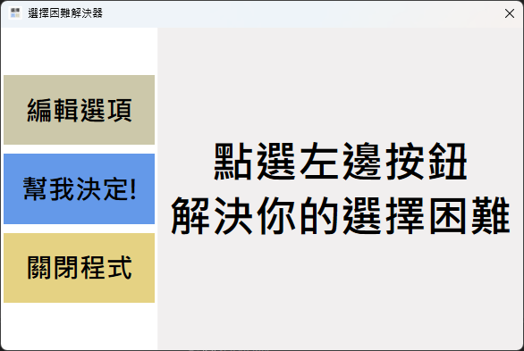
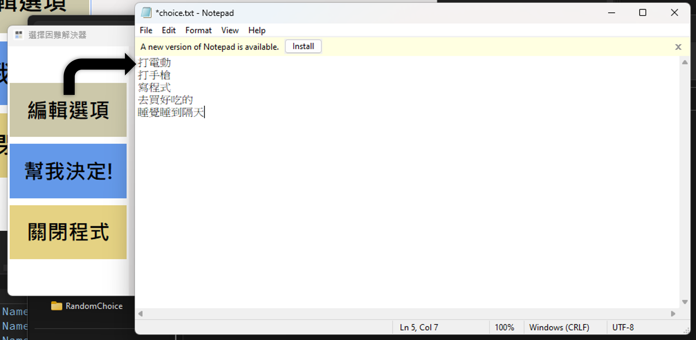
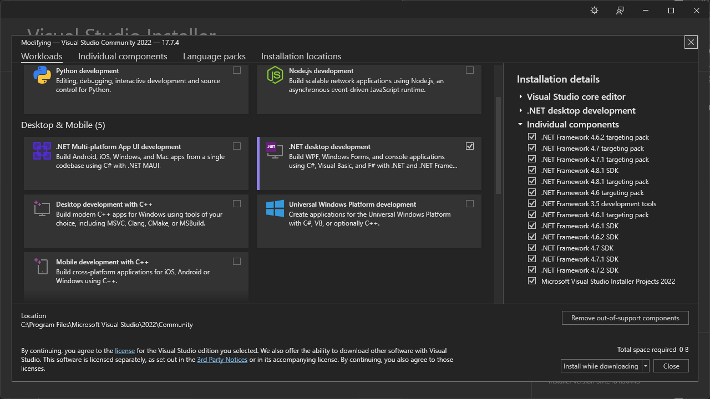

# RandomChoice
一個可以解決你「選擇困難的」小工具。

# Features
- 使用文字檔儲存選項。（檔案會保存在`C:\RandomChoice`）
- *TODO...*

# ScreenShot

    
    

# Build
1. Clone This Git To Your Computer.
3. Open `RandomChoice.sln`.
4. Select Debug / Release Options, Then Click Build.
5. The Application Will Be Open Automatically.

# Develop Tools

- Visual Studio 2022
    - .NET Desktop Environment
- .NET SDK 6